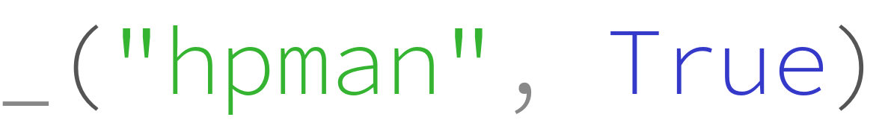

---

# hpman (超参侠): The uncompromising hyperparameter manager.

[](https://app.circleci.com/pipelines/github/megvii-research/hpman)
[](https://megvii-hpman.readthedocs-hosted.com/en/latest/)
[](https://codecov.io/gh/megvii-research/hpman)


**hpman** is a hyperparameter manager (HPM) library that truly makes sense.
It enables a Distributed-Centralized HPM experience in deep learning
experiments. You can define hyperparameters anywhere, but manage them as a
whole.

hpman is intended to be used as a basic building block for downstream tools, such as
command-line interface, IDE integration, experiment management system, etc.

hpman supports Python version greater equal than 3.5.


# Example

`lib.py`:
```python
# File: lib.py
from hpman.m import _


def add():
    return _("a", 0) + _("b", 0)


def mult():
    return _("a") * _("b")
```

`main.py`:
```python
#!/usr/bin/env python3
import os
import argparse

from hpman.m import _

import lib


def main():
    basedir = os.path.dirname(os.path.realpath(__file__))
    _.parse_file(basedir)

    parser = argparse.ArgumentParser()
    parser.add_argument("-a", default=_.get_value("a"), type=int)
    parser.add_argument("-b", default=_.get_value("b"), type=int)
    args = parser.parse_args()

    _.set_value("a", args.a)
    _.set_value("b", args.b)

    print("a = {}".format(_.get_value("a")))
    print("b = {}".format(_.get_value("b")))
    print("lib.add() = {}".format(lib.add()))
    print("lib.mult() = {}".format(lib.mult()))


if __name__ == "__main__":
    main()
```

Results:
```bash
$ ./main.py
a = 0
b = 0
lib.add() = 0
lib.mult() = 0

$ ./main.py -a 2 -b 3
a = 2
b = 3
lib.add() = 5
lib.mult() = 6
```

This is the core library designed for data manipulation. You may want to use a
better front-end:
- [CLI examples](https://github.com/megvii-research/hpargparse)


# Installation
```
pip install hpman
```

# Story
Managing ever-changing hyperparameters is a pain in the a\*\*.
From the practice of performing an enormous amount of deep learning experiments,
we found two existing hyperparameter managing patterns of the utmost
prevalence.

## Centralized HPM
We call the first type "**centralized HPM**". It follows the way of
configuration management in traditional software, regardless of using a python
file or json or yaml or whatever that can store some key-value mapping (may
remind you of `settings.ini`, `nginx.conf`, `config.yaml` etc.):
```python
# File: config.py
BATCH_SIZE = 256
NUM_EPOCH = 120
LEARNING_RATE = 1e-1
WEIGHT_DECAY = 4e-5
OPTIMIZER = 'SGD'
LR_DECAY_EPOCHS = [30, 60, 90]
HIDDEN_CHANNELS = 128
NUM_LAYERS = 5
INPUT_CHANNELS = 784
OUTPUT_CHANNELS = 10
```

```python
# File: model.py
from torch import nn
import config

def build_model():
    model = nn.Sequential()
    model.add_module('stem',nn.Sequential(nn.Linear(config.INPUT_CHANNELS, config.HIDDEN_CHANNELS),
                        nn.BatchNorm1d(config.HIDDEN_CHANNELS),
                        nn.ReLU()))
    for i in range(config.NUM_LAYERS - 1):
        model.add_module(f'layer{i}', nn.Sequential(nn.Linear(config.HIDDEN_CHANNELS, config.HIDDEN_CHANNELS),
                      nn.BatchNorm1d(config.HIDDEN_CHANNELS),
                      nn.ReLU()))
    model.add_module('fc', nn.Linear(config.HIDDEN_CHANNELS, config.OUTPUT_CHANNELS))
    return model
```
This way of manaing hyperparameters is widely seen in machine learning
libraries, e.g., xgboost, whose hyperparameters are fairly stable compare than
that in deep learning research.

## However ...
However, it is quite common for researchers to add some hyperparameters at
their inspiration (e.g., suddenly come up with a "Temperature" parameter in
softmax.). They found pleasure in tweaking the hyperparameters, but quickly
abandon it if the experiment goes wrong. These acts are called [Non-Recurring
Engineering (NRE)](https://en.wikipedia.org/wiki/Non-recurring_engineering).

In these cases, the "centralized HPM" reveals obvious drawbacks:
1. Whenever you need to introduce a new hyperparameter, you must kind of
   "declare" it in the configuration file, while using it in some
   deeply-nested easy-to-forget files.
2. Whenever you need to abandon an existing hyperparameter, you must not only
   remove all the appearances of that hyperparameter in some deeply-nested
   easy-to-forget files, but also remove it in the centralized configuration
   file.
3. There's a "Heisenberg uncertainty principle" on hyperparameters: you cannot
   know both what and where the hyperparameters are at the same time.  The
   context around where the hyperparameter is used conveys valuable information
   of the precise use-case of that hyperparameter.  You can either look it up
   in the code, or the centralized config file.

These drawbacks essentially require the user to maintain a distributed data
structure, which not only induces great mental burden doing experiments,
but also be error-prone to bugs.


## Distributed HPM
So researchers come to another solution: forget about config files; define and
use whatever hyperparameters whenever you need, anywhere in the project. We
call this "Distributed HPM". However, this is hardly called "management"; it
is more like anarchism: no management is the best management. It makes adding a
hyperparameter cheap: let yourself free and do whatever you want.

> Let it go, let it go

```python
from torch import nn

def build_model():
    hidden_channels = 128  # <-- hyperparameter
    model=nn.Sequential()
    model.add_module('stem',nn.Sequential(nn.Linear(784, hidden_channels), # <-- hyperparameter
            nn.BatchNorm1d(hidden_channels),
            nn.ReLU()))
    for i in range(4):
        model.add_module(f'layer{i}', nn.Sequential(nn.Linear(hidden_channels, hidden_channels),
            nn.BatchNorm1d(hidden_channels),
            nn.ReLU()))
    model.add_module('fc',nn.Linear(hidden_channels, 10))  # <-- hyperparameter
    return model
```

However, barbaric growth of hyperparameters of different names in different
places without governance would soon run into a disaster in knowledge sharing,
communication, reproduction, and engineering. Nobody knows what happened, when
did it happen, and nobody knows how to know easily. You know nothing unless
you read and diff through all the source codes.

> You know nothing, Jon Snow.
>
> 咱也不知道，咱也不敢问呀


## Distributed-Centralized HPM
Now we have two ways of managing hyperparameters: one is good for engineering
but inconvenient for researchers, another one is convenient for researchers,
but bad for engineering.

We are uncompromising. We did not want to decide between these two
choices; we want the best of both worlds.

> Only children make choices, adults want them all.
>
> 小孩子才做选择，大人全都要

After some trial and error, we came up with a design like this:

`main.py`
```python
#!/usr/bin/env python3

from hpman.m import _
import hpargparse

import argparse


def func():
    weight_decay = _("weight_decay", 1e-5)
    print("weight decay is {}".format(weight_decay))


def main():
    parser = argparse.ArgumentParser()
    _.parse_file(__file__)
    hpargparse.bind(parser, _)
    parser.parse_args()

    func()


if __name__ == "__main__":
    main()
```

and you can:
```bash
$ ./main.py
weight decay is 1e-05
$ ./main.py --weight-decay 1e-4
weight decay is 0.0001
$ ./main.py --weight-decay 1e-4 --hp-list
weight_decay: 0.0001
$ ./main.py --weight-decay 1e-4 --hp-list detail
All hyperparameters:
    ['weight_decay']
Details:
+--------------+--------+---------+--------------------------------------------------------------+
| name         | type   |   value | details                                                      |
+==============+========+=========+==============================================================+
| weight_decay | float  |  0.0001 | occurrence[0]:                                               |
|              |        |         |   ./main.py:10                                               |
|              |        |         |      5:                                                      |
|              |        |         |      6: import argparse                                      |
|              |        |         |      7:                                                      |
|              |        |         |      8:                                                      |
|              |        |         |      9: def func():                                          |
|              |        |         | ==> 10:     weight_decay = _("weight_decay", 1e-5)           |
|              |        |         |     11:     print("weight decay is {}".format(weight_decay)) |
|              |        |         |     12:                                                      |
|              |        |         |     13:                                                      |
|              |        |         |     14: def main():                                          |
|              |        |         |     15:     parser = argparse.ArgumentParser()               |
+--------------+--------+---------+--------------------------------------------------------------+
$ ./main.py -h
usage: main.py [-h] [--weight-decay WEIGHT_DECAY] [--hp-save HP_SAVE]
               [--hp-load HP_LOAD] [--hp-list [{detail,yaml}]]
               [--hp-serial-format {auto,yaml,pickle}] [--hp-exit]

optional arguments:
  -h, --help            show this help message and exit
  --weight-decay WEIGHT_DECAY
  --hp-save HP_SAVE     Save hyperparameters to a file. The hyperparameters
                        are saved after processing of all other options
  --hp-load HP_LOAD     Load hyperparameters from a file. The hyperparameters
                        are loaded before any other options are processed
  --hp-list [{detail,yaml}]
                        List all available hyperparameters. If `--hp-list
                        detail` is specified, a verbose table will be print
  --hp-serial-format {auto,yaml,pickle}
                        Format of the saved config file. Defaults to auto. Can
                        be set to override auto file type deduction.
  --hp-exit             process all hpargparse actions and quit
```
(Example are taken from [hpargparse](https://github.com/megvii-research/hpargparse))

We are now both **distributed** (write anywhere) and **centralized** (manage them as a whole).

Our design is inspired by the [underscore
function](https://www.gnu.org/software/gettext/manual/html_node/Mark-Keywords.html)
commonly used in [gettext](https://www.gnu.org/software/gettext/) in software
translation. We deem "hyperparameters" as slots of text to be translated,
while different hyperparameter values correspond to different "language" of the
same text.

We achieve the above things by parsing your source code statically and extract
where and how you are defining your hyperparameters. It follows the thoughts
of [Code as Data](https://en.wikipedia.org/wiki/Code_as_data).

Also, expression evaluation in hpman is quite safe as we are using
`ast.literal_eval`.


# Features
## Arbitrary Imports
Hyperparameter managers are the most important objects of hpman. We are
using `from hpman.m import _` throughout the tutorial, as well as recommend
using underscore ("_", courtesy of
[gettext](https://www.gnu.org/software/gettext/)) as the name of imports in
practice, but you can use anything name you want.

The `hpman.m` module is configured to allow arbitrary imports. Whatever you
import will always be an object of hyperparameter manager and works the same as
"_":

```bash
from hpman.m import _, hpm, hp, ddd, abc, hello
ddd('a', 1)
abc('a', 2)
_('hello', 3)
```

Hyperparameter managers imported by different names work independently and work
in parallel. Imports of the same name are cached in the sense that, imports of
the same name in the same process will return always the same object.


There are caveats:
- Assignment of these imported objects to variables will not work in static
  parsing (will be addressed later), but works at runtime (if you skipped
  parsing stage). e.g.:

```python
# XXX: BAD EXAMPLE
from hpman.m import _
hello = _  # this breaks the rule
hello('a', 1)  # <-- hpman will not be aware of this 'a' hyperparameter.
```
- Variables share the same name with `hpman.m` imports will be statically
  parsed by hpman, but will not work as expected at runtime. e.g.:

```python
def func(*args, **kargs):
    pass

_ = func

_("a", 1)  # <-- hpman can do nothing with "_" at runtime

from hpman.m import _

print(_.parse_file(__file__).get_values())
# Will output "{'a': 1}", which is a "false positive" of hyperparameter
# occurrence.
```

## Define Hyperparameters
The most basic (and the most frequently used) function of hpman is to define a
hyperparameter.

```python
from hpman.m import _

def training_loop():
    # training settings
    batch_size = _('batch_size', 128)

    # first use of `num_layer` is recommend to come with default value
    print('num_layers = {}'.format(_('num_layers', 50)))

    # use it directly without storing the values
    if _('use_resnet', True):
    # second use of `num_layer` should not provide default value
    for i in range(_('num_layers')):
        pass
```

There are a few caveats:
1. Among all the occurrence of the same hyperparameter, **one and only one**
   occurrence should come with a default value. Nonetheless, which one has the
   default value does not matter (you can surely first use, then define the
   default value in later occurrence).
2. The name of the hyperparameter must be a **literal string**.
3. The value of the hyperparameter can be an arbitrary object (variable,
   lambda, string, whatever), but it is highly recommended to use only
   **literal values**, which is precisely defined by what `ast.literal_eval`
   function accepts. It not only makes the serialization of hyperparameters in
   downstream frameworks (such as hpargparse) easier but also improves the
   interoperability of hyperparameter settings among different programming
   languages and frameworks. The readability of dumped hyperparameters will be
   more readable as well.

## Static Parsing
We employ static parsing to retrieve information on where and how you are using
the hyperparameters in your source codes. It is employed by `_.parse_file` and
`_.parse_source`.

- `_.parse_file` accepts file paths, directory names, or a list of both. It
  internally calls `_.parse_source`.
- `_.parse_source` accepts only a piece of source code string.

Examples:
```python
_.parse_file(__file__)
_.parse_file('main.py')
_.parse_file('library_dir')
_.parse_file(['main.py', 'library_dir'])

_.parse_source('_("a", 1)')
```

Parsing is done using the `ast` module provided in the python standard library.
We match all function calls with required syntax to detect proper calls to
hyperparameter manager.

## Runtime Value Getter/Setter
Value of a hyperparameter can be retrieved by two ways in runtime:
1. use `__call__` syntax: `_('varname')`
2. use dedicated function: `_.get_value('varname')`

A dict of all hyperparameters can be retrieved by `_.get_values()`

Setting a hyperparameter can only be done with
```python
_.set_value('varname', value)
```

## Hints
**Hints** is intended to provide a mechanism for extending hpman.

It provides an interface to store and retrieve arbitrary information provided
at hyperparameter definition.
Downstream libraries and frameworks could utilize this provided information to
better serve its purpose.

For example, say we would like to create an argparse interface for setting
hyperparameters from the command line, a user could write something like

```python
_('optimizer', 'adam', choices=['adam', 'sgd'])
```

in their codebase, and the entry point of the program, we could
retrieve this information and provide better argparse options:

```python
# File: hints_example.py
from hpman.m import _
from hpman.hpm_db import L

import argparse

_('optimizer', 'adam', choices=['adam', 'sgd'])


if __name__ == '__main__':
    parser = argparse.ArgumentParser()
    _.parse_file(__file__)
    occurrences = _.db.select(lambda row: row.name == 'optimizer')
    oc = [
        oc
        for oc in occurrences
        if oc['hints'] is not None
    ][0]
    choices = oc['hints']['choices']
    value = oc['value']

    parser.add_argument('--optimizer', default=value, choices=choices)
    args = parser.parse_args()

    print('optimizer: {}'.format(args.optimizer))
```

usecase is as follows:
```bash
$ python3 hints_example.py
optimizer: adam
$ python3 hints_example.py -h
usage: hints_example.py [-h] [--optimizer {adam,sgd}]

optional arguments:
  -h, --help            show this help message and exit
  --optimizer {adam,sgd}
$ python3 hints_example.py --optimizer sgd
optimizer: sgd
$ python3 hints_example.py --optimizer rmsprop
usage: hints_example.py [-h] [--optimizer {adam,sgd}]
hints_example.py: error: argument --optimizer: invalid choice: 'rmsprop' (choose from 'adam', 'sgd')
```

The example can be found at [examples/02-hints](examples/02-hints)

# Development
1. Install requirements:
```bash
pip install -r requirements.dev.txt
```

2. Activate git commit template
```
git config commit.template .git-commit-template.txt
```

3. Install pre-commit hook
```bash
pre-commit install
```

4. To format your source code
```base
make format
```

5. To check the coding style
```base
make style-check
```

# CAVEAT
This project is still in its early stage. API may subject to radical changes
(until version 1.0.0).
